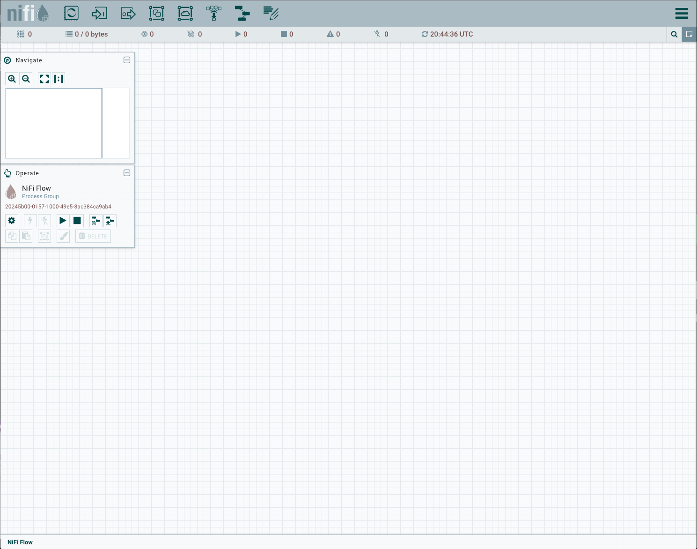
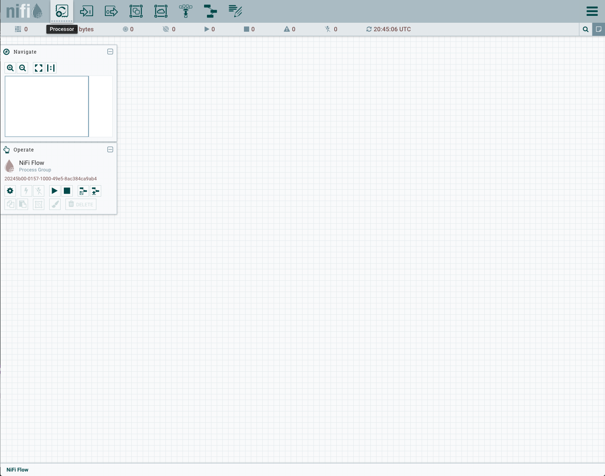

# Data Flow - Dastabase Table to Hive/Impala

TODO - Description.

## Prerequisites
* xxxxxx.
* xxxxxx.

## Steps
1. Access the NiFi web UI via (http://vm-nifi-env:8080/nifi). You should see the default canvas:

2. Add a Process Group and after add processors to NiFi by dragging the Processor icon from the left icon bar to the canvas. This screenshot shows the Processor icon:

3. xxxxxxx

 

## Review
TODO.
