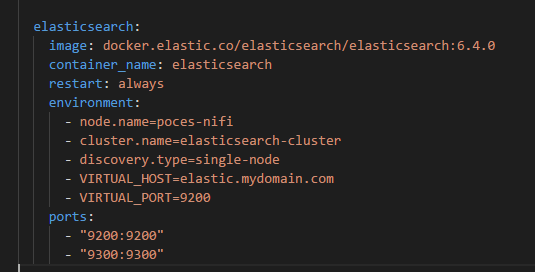

# Data Flow - Twitter to Elasticsearch

The purpose of this data flow is to show you the process of using NiFi to pull data from Twitter, by filter and push it to Elasticsearch.


## Prerequisites
* The Nifi, Elasticseach and Kibana´s image container should up and running in our vagrant environemnt.
* You should already have twitter access keys. You create your access keys here: [Twitter Apps](https://apps.twitter.com/). Read more here: [Twitter Docs](https://dev.twitter.com/oauth/overview/application-owner-access-tokens).

## Steps
1. Access the NiFi web UI via (http://vm-nifi-env:8080/nifi). You should see the default canvas:


2. Add a Process Group and after add processors to NiFi by dragging the Processor icon from the left icon bar to the canvas. This screenshot shows the Processor icon:


3. Add GetTwitter Processor: 
* Drag the Processor icon to the canvas. In the Add Processor dialog, enter "twitter" in the Filter box. This will filter the list of processors to show you matching processor names. You should see something similar to this:


* Select the GetTwitter processor and click the ADD button. This will add the processor to the canvas. Your canvas should look similar to this:


4. Configure GetTwitter processor. Right click on 'GetTwitter' processor (near top) and click Configure. Under Properties, fill with informations:
- Twitter Endpoint -> Set to Filter Endpoint
- Consumer Key -> From twitter app
- Consumer Secret -> From twitter app
- Access Token -> From twitter app
- Access Token Secret -> From twitter app
- Terms to Filter on -> Set to "apache,nifi"


5. Add and configure PutElasticsearch Processor: Drag the Processor icon to the canvas. In the Add Processor dialog, enter "elastic" in the Filter box. Select the PutElasticsearch processor and click the ADD button. This will add the processor to the canvas. Your canvas should look similar to this:


6. Configure PutElasticsearch Processor: Right click on the PutElasticsearch processor, and click Configure. Under Properties, fill with informations:
- Cluster Name -> Set to elasticsearch-cluster (this should match the cluster name in the docker-compose.yml configuration file).
- ElasticSearch Hosts -> Set to elasticsearch:9300 (note the port is 9300, not 9200).
- Identifier Attribute -> Set to uuid (this uses a unique id generated by Elasticsearch).
- Index -> Set this to twitter (this can be any index name you want).
- Type -> Set this to default (we are not using types, so can be any type name you want).
- All other settings left at defaults.


Docker-compose config:




7.  Add and configure LogAtrtribute Processor: Drag the Processor icon to the canvas. In the Add Processor dialog, enter "logattribute" in the Filter box. Select the LogAttribute processor and click the ADD button. This will add the processor to the canvas. Your canvas should look similar to this:


8. Create Connect Procesors: Hover over the GetTwitter processor. You should see a dark circle with a white arrow in the middle. Drag this icon down over top of the PutElasticearch processor. The Create Connection dialog should open. It should look similar to this:


Repeat this procedure to LogAttribute processor.

9. Hover over the PutElasticsearch processor. Drag the arrow icon out past the PutElasticsearch processor, then back over top of it and release. This will display the Create Connection dialog. This connection is needed for fail or retry operations. Select the failure and retry options under Relationships. It should look similar to this::


10. Now start all processors: Right click on the GetTwitter processor to display the context menu. Click the Start option. This will start the processor. Right click on the PutElasticsearch processor to display the context menu. Click the Start option. This will start the processor. Right click on the LogAttribute processor to display the context menu. Click the Start option. This will start the processor.

11. You can verify that tweets are being written to Elasticsearch by typing the following in a browser window:
```http://vm-nifi-env:9200/twitter/_search?pretty```

12. You can access the twittes too using the Kibana, access the web UI: 
```http://vm-nifi-env:5601/```


<br>

## Review
You made the necessary configuration changes so that NiFi and Elasticsearch would run. You created a NiFi workflow using the GetTwitter, LogAttribute and PutElasticsearch processors. The processors should have successfully pulled data from Twitter and pushed data to Elasticsearch. Finally, you should have been able to query Elasticsearch using Kibana.
